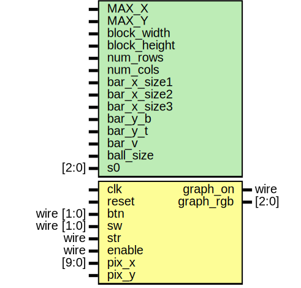

# Entity: game_process2 

- **File**: game_process2.v
## Diagram

## Generics

| Generic name | Type  | Value  | Description |
| ------------ | ----- | ------ | ----------- |
| MAX_X        |       | 640    |             |
| MAX_Y        |       | 480    |             |
| block0_x     |       | 170    |             |
| block1_x     |       | 290    |             |
| block2_x     |       | 410    |             |
| block_y      |       | 180    |             |
| width        |       | 40     |             |
| length       |       | 60     |             |
| bar_x_size1  |       | 240    |             |
| bar_x_size2  |       | 40     |             |
| bar_x_size3  |       | 30     |             |
| bar_y_b      |       | 357    |             |
| bar_y_t      |       | 353    |             |
| bar_v        |       | 2      |             |
| ball_size    |       | 8      |             |
| s0           | [2:0] | 3'b000 |             |
## Ports

| Port name | Direction | Type       | Description |
| --------- | --------- | ---------- | ----------- |
| clk       | input     |            |             |
| reset     | input     |            |             |
| btn       | input     | wire [1:0] |             |
| sw        | input     | wire [1:0] |             |
| str       | input     | wire       |             |
| pix_x     | input     | [9:0]      |             |
| pix_y     | input     |            |             |
| graph_on  | output    | wire       |             |
| graph_rgb | output    | [2:0]      |             |
## Signals

| Name        | Type       | Description |
| ----------- | ---------- | ----------- |
| refr_tick   | wire       |             |
| block_on    | wire [2:0] |             |
| bar_x_size  | reg [9:0]  |             |
| bar_on      | wire       |             |
| bar_x_l     | wire [9:0] |             |
| bar_x_r     | wire [9:0] |             |
| bar_x_reg   | reg[9:0]   |             |
| bar_x_next  | reg[9:0]   |             |
| ball_x_l    | wire [9:0] |             |
| ball_x_r    | wire [9:0] |             |
| ball_y_t    | wire [9:0] |             |
| ball_y_b    | wire [9:0] |             |
| ball_x_reg  | reg [9:0]  |             |
| ball_y_reg  | reg [9:0]  |             |
| ball_x_next | wire [9:0] |             |
| ball_y_next | wire [9:0] |             |
| rom_addr    | wire [2:0] |             |
| rom_col     | wire [2:0] |             |
| rom_data    | reg [7:0]  |             |
| rom_bit     | wire       |             |
| sq_ball_on  | wire       |             |
| rd_ball_on  | wire       |             |
| move_state  | reg[2:0]   |             |
| x_v_reg     | reg [9:0]  |             |
| x_v_next    | reg [9:0]  |             |
| y_v_reg     | reg [9:0]  |             |
| y_v_next    | reg [9:0]  |             |
| str_run     | reg        |             |
| ball_v_0    | reg[9:0]   |             |
| ball_v_1    | reg[9:0]   |             |
| LED_reg     | reg [1:0]  |             |
## Constants

| Name      | Type | Value | Description |
| --------- | ---- | ----- | ----------- |
| ball_v_10 |      | -1    |             |
| ball_v_11 |      | 1     |             |
## Processes
- unnamed: ( @* )
  - **Type:** always
- unnamed: ( @* )
  - **Type:** always
- unnamed: ( @* )
  - **Type:** always
- unnamed: ( @(posedge clk or negedge reset) )
  - **Type:** always
- unnamed: ( @(posedge clk or negedge reset) )
  - **Type:** always
- unnamed: ( @* )
  - **Type:** always
- unnamed: ( @* )
  - **Type:** always
## State machines

